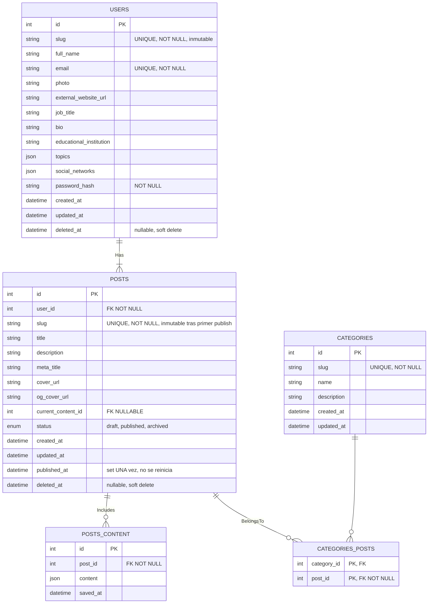

<a id="readme-top"></a>

# Porfolio & Personal Blog (CMS)

## Project Description

A personal portfolio and blogging platform built with ASP.NET Core, Blazor Server, and .NET 10, following Domain-Driven Design (DDD) and Hexagonal (Ports & Adapters) Architecture.

The goal of this project is not only to showcase my work, but also to serve as a playground for experimenting with software architecture, clean code, and modern backend development practices.

Instead of relying on a traditional CMS, the application is designed around a block-based content editor, allowing blog posts to be composed from reusable content blocks.

> **Proyect Status**
> 
> This proyect is currently under active development.
>
> Core architectural foundations have already been implemented, while several features (including the block editor CMS) are still in progress.


<p align="right">(<a href="#readme-top">Top</a>)</p>

## Table of Content 

- [Project Goals](#proj-goals)
- [Features](#feats)
- [Architecture](#architecture)
- [Database Design](#data-design)
- [Technologies](#tech)
- [Getting Started](#get-started)
- [Project Structure](#proj-struct)
- [Roadmap](#roadmap)
- [Contributing](#contributing)
- [Author](#author)

<p align="right">(<a href="#readme-top">Top</a>)</p>

## Project Goals <a id="proj-goals"></a>

This project has two main objectives:
- Build a personal portfolio.
- Develop a blogging platform.

From a technical perspective, the project focuses on:
- Domain-Driven Design (DDD)
- Hexagonal Architecture
- SOLID principles

<p align="right">(<a href="#readme-top">Top</a>)</p>

## Features <a id="feats"></a>

- [x] Authentication
- [x] User registration
- [x] Session management
- [x] Admin dashboard
- [x] Manage user profile
- [ ] Manage blog categories
- [ ] Block-based CMS
- [ ] Post editor
- [ ] Advanced search
- [ ] Porfolio + personal projects views
- [ ] SEO + OpenGraph + schema (automatic JSON-LD)

<p align="right">(<a href="#readme-top">Top</a>)</p>

## Architecture <a id="architecture"></a>

The application follows Hexagonal Architecture.

The application is divided in 4 layers:
- Domain (Entities, Value Objects, Domain rules)
- Application (Use Cases)
- Infraestructure (Entity Framework, Authenticantion, External Services)
- Presentation (Blazor or API)

Comunication between layers is done using dependency injection.

<p align="right">(<a href="#readme-top">Top</a>)</p>

## Database Design <a id="data-design"></a>



- Content is stored as JSON and is transformed into HTML server-side.
- Media like images are not stored in this application, thus we make use an external CDN.

<p align="right">(<a href="#readme-top">Top</a>)</p>

## Technologies <a id="tech"></a>

### Backend:
- .NET 10
- Blazor Server

<p align="right">(<a href="#readme-top">Top</a>)</p>

## Getting Started <a id="get-started"></a>

> Deploy in Azure Service Plan free tier?

<p align="right">(<a href="#readme-top">Top</a>)</p>

## Project Structure <a id="proj-struct"></a>

```
Domain/ 
│ 
├── Entities 
├── ValueObjects 
└── Domain Services 

Application/ 
│ 
├── UseCases 
├── DTOs 
├── Interfaces 
└── Validators 

Infrastructure/ 
│ 
├── Persistence 
├── Repositories 
├── Authentication 
└── Services 

UI/ 
│ 
├── Components 
├── Pages 
└── Layout

API/
```

<p align="right">(<a href="#readme-top">Top</a>)</p>

## Roadmap <a id="roadmap"></a>

<p align="right">(<a href="#readme-top">Top</a>)</p>

## Contributing <a id="contributing"></a>

This is a personal learning project, but suggestions, ideas and constructive feedback are always welcome.

Feel free to open an issue if you have improvements or recommendations.

<p align="right">(<a href="#readme-top">Top</a>)</p>

## Author <a id="author"></a>

**Andrés Pérez Guardiola**

Full Stack Developer

<p align="right">(<a href="#readme-top">Top</a>)</p>